# Forum
Internet forum

<h3>Home page of this Internet forum 
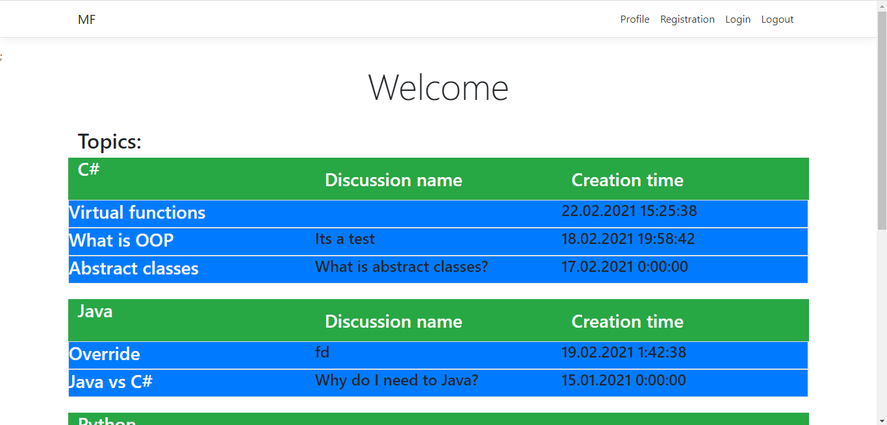
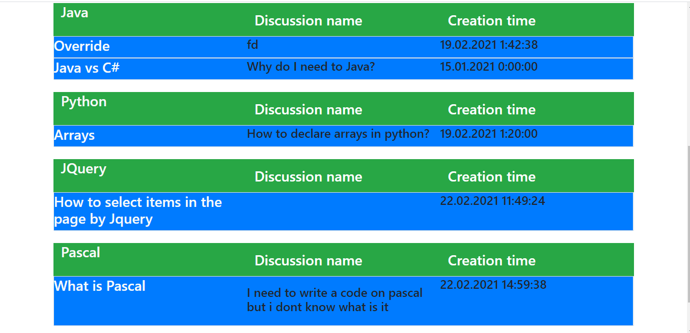  

If you go to one of the topics, a separate page will open with the number of all discussions and a list of all discussions.
Each line contains the name of the discussion, its description and the last message in the discussion. 
Also you can create your own discussion in this page.
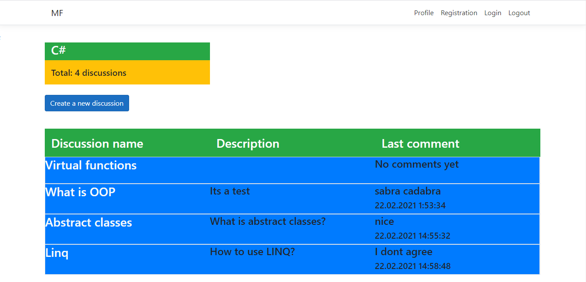  

To write messages and create new discussions you need to be logged in.
(If you are an admin you also can create new topics and delete messages from other users)
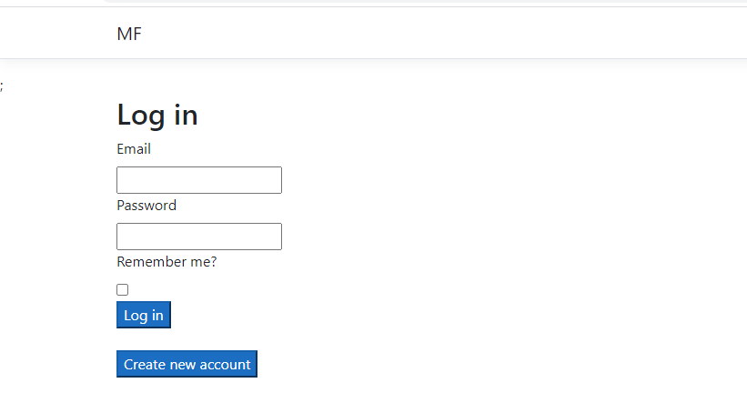  
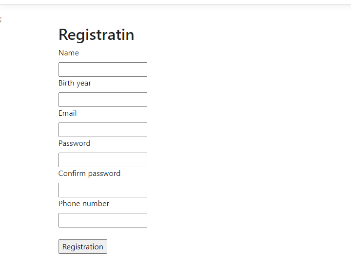  

To create a new discussion you just need to write the name and description of discussion(description is optional)
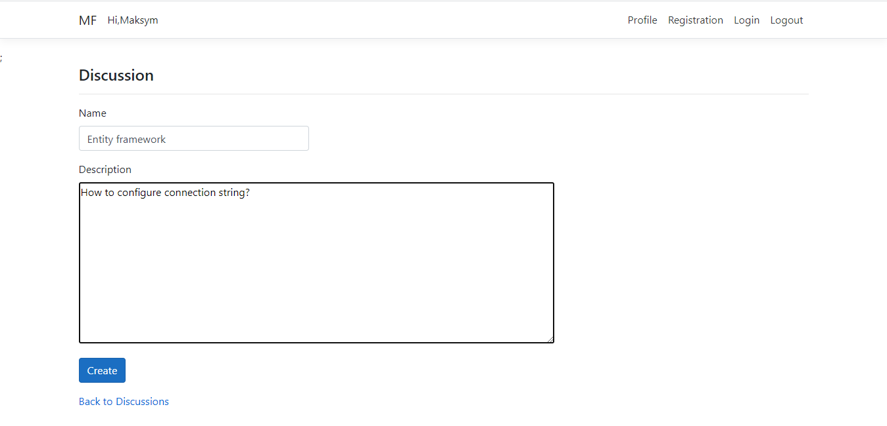  

After discussion creation you redirected to your discussion
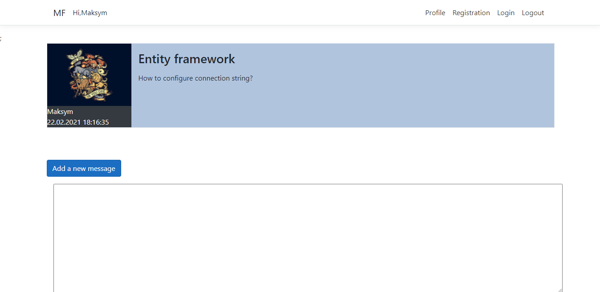  

Here you can add a new comment
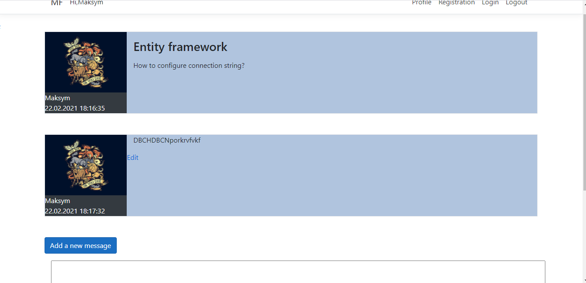  
And edit your comments
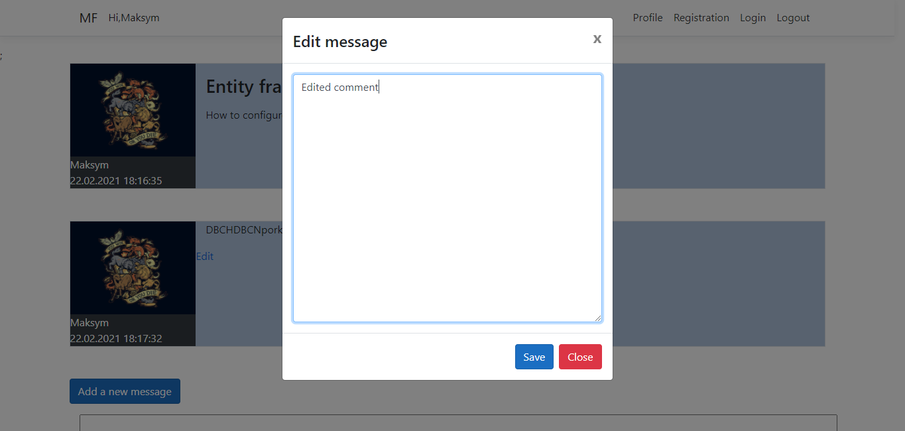
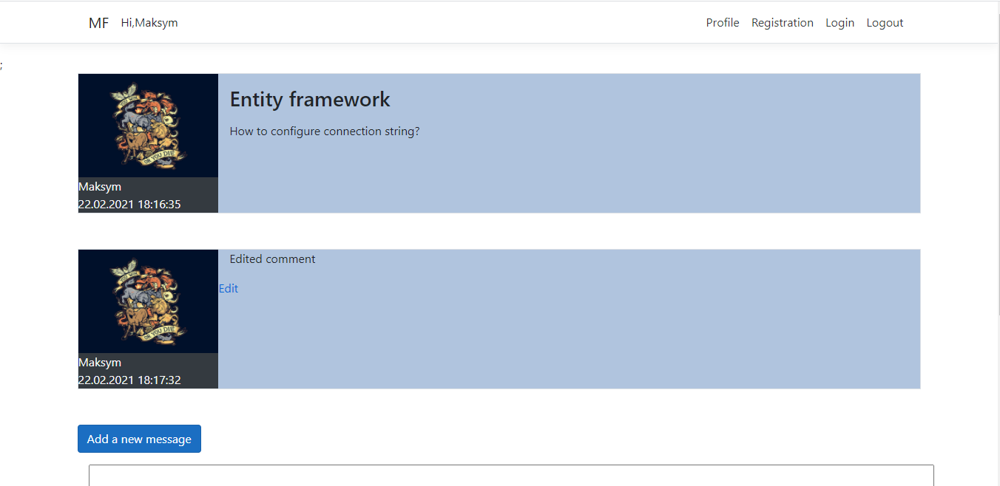  

Admins also can delete messages
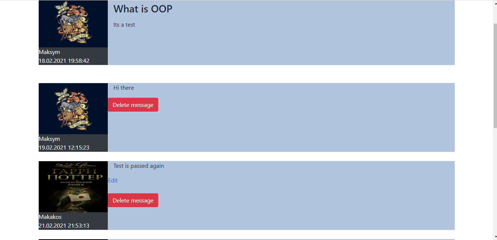  

As was mentioned before admins can create new topics
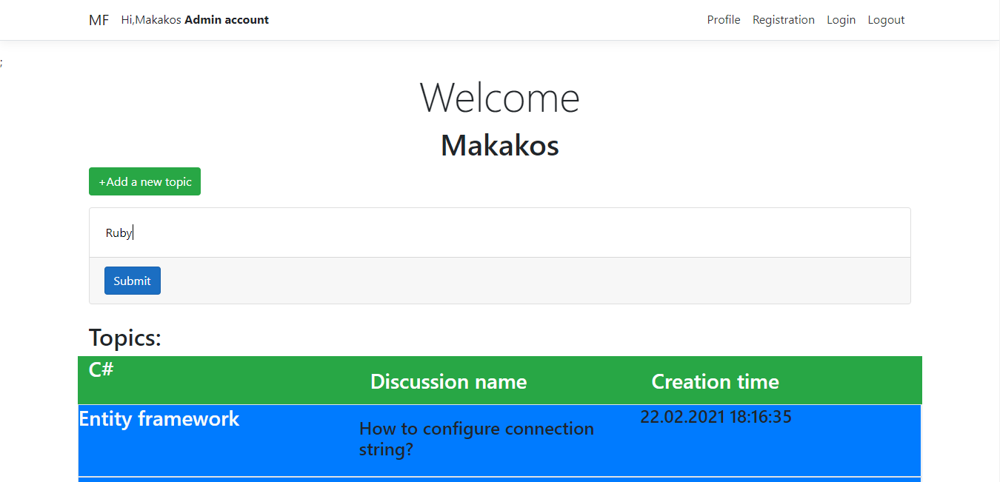

On the tab "Profile" you can see information about your account, here you can add avatar of your 
profile(which is not exists by default) and change name, phone number and email
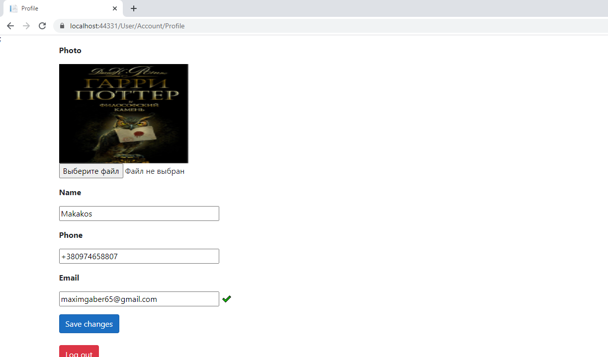  
</h3>
